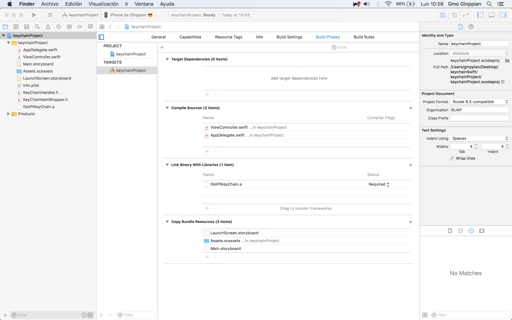
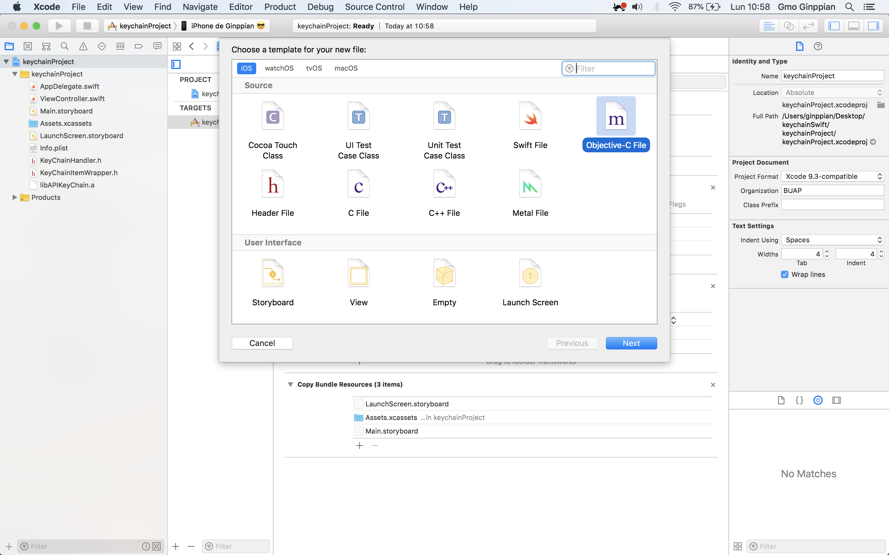
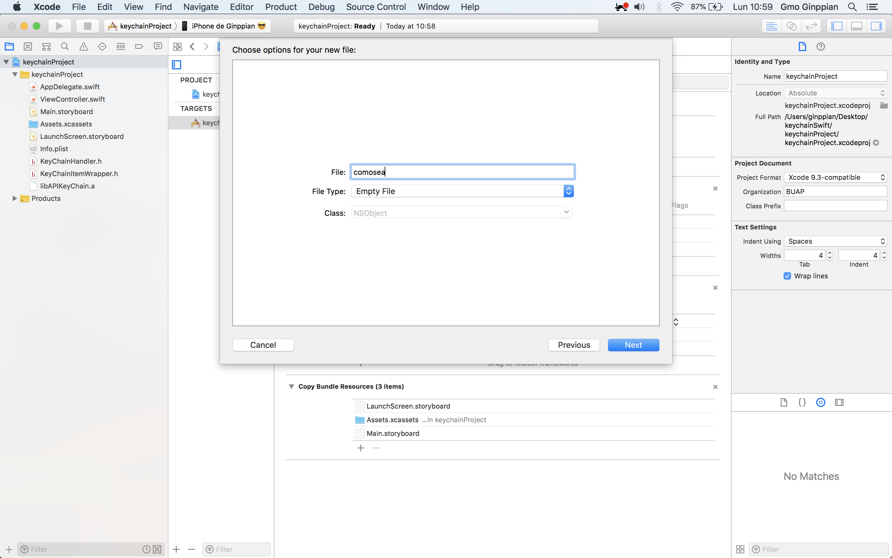
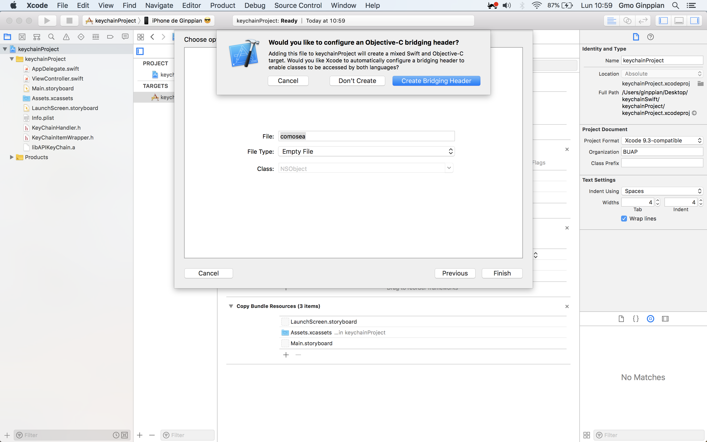
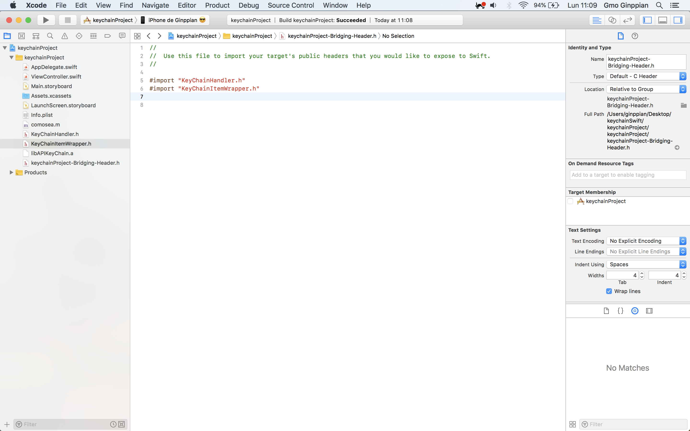
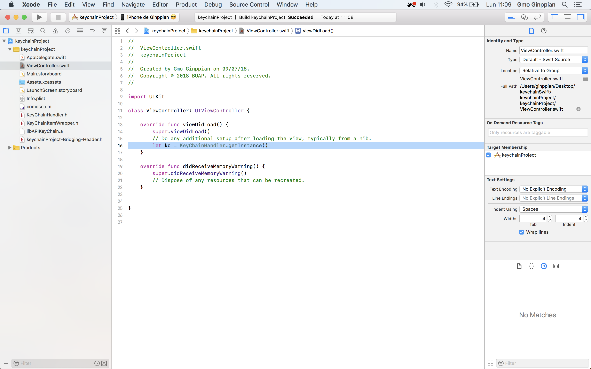
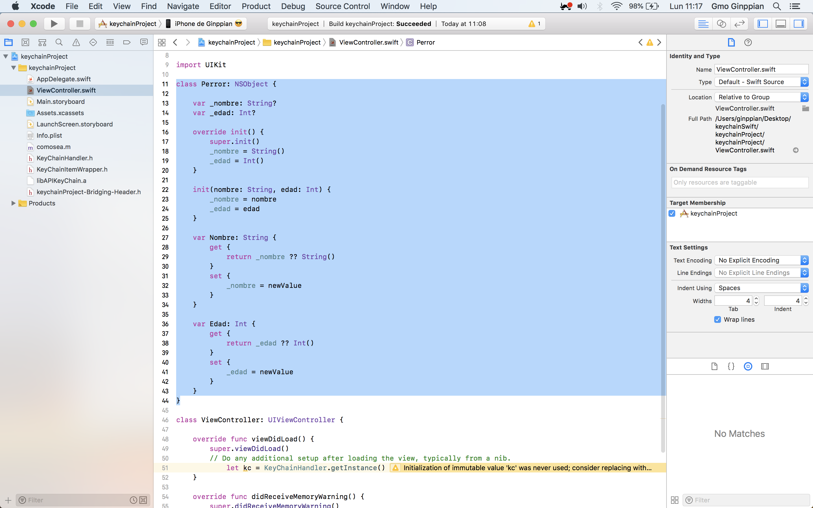
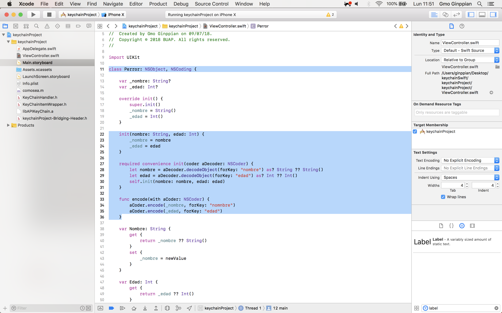
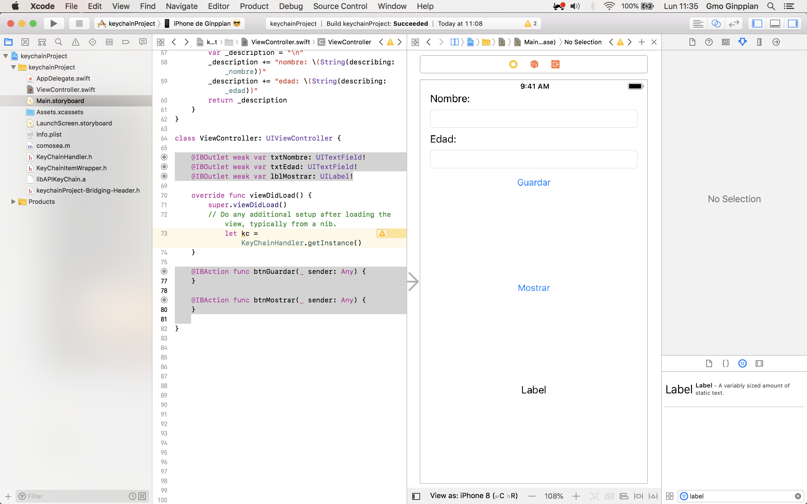
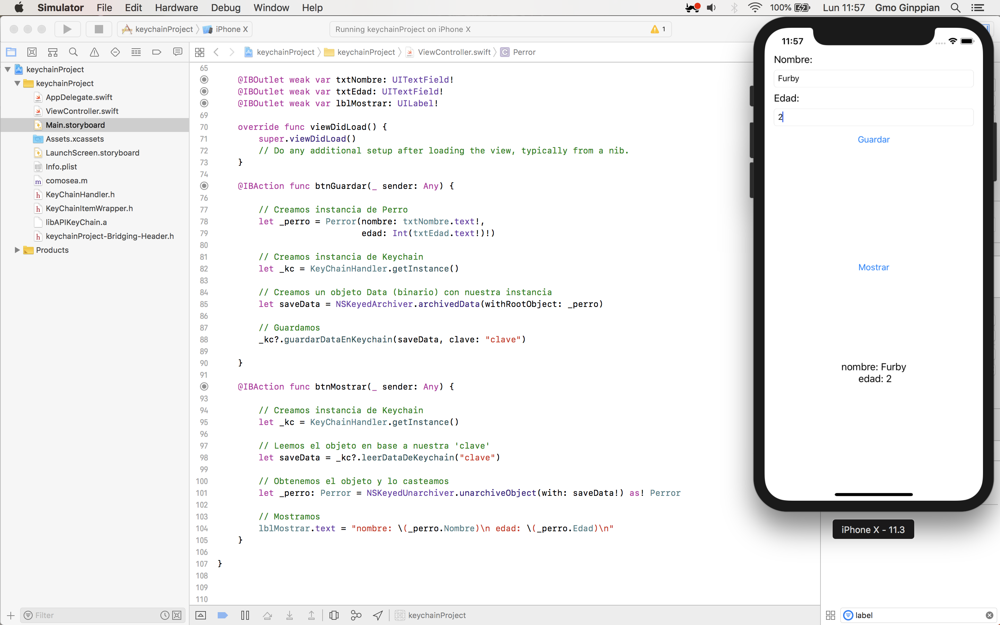

Keychain Swift
===

Existen diversas implementaciónes del Keychain para iOS a continuación mostramos una de ellas, no es oficial.

## Implementación

### Paso 1 - Importar las librerías

**Importamos**

Arrastramos y soltando los siguientes archivos, dejando la opción Copy items if is needed:

* libAPIKeyChain.a 
* KeyChainHandler.h
* KeyChainItemWrapper.h

verificamos que libAPIKeyChain.a se encuentre linkeada en *Link Binary Whit Libraries* y no se encuentre en *Copy Bundle Resources* pues si se encuentra en *Copy Bundle Resources* al subir a tienda no nos dejará subirla, pues no permite subir una aplicación junto con archivos binarios.

<p align="center">
	
</p>


### Paso 2 - Creamos un archivo puente con Obj-C

Debido a que nuestra librería de keychain está escrita en Obj-C debemos crear un archivo *Bridging Header* que permitirá importar la cabecera y que usemos las funciónes indicadas en ese archivo cabecera en nuestro código de Swift.

Es muy fácil basta con crear un nuevo archivo .m > nombrarlo como sea > al finalizar nos dara la opción de *Crate Bridging Header* y nos creara un archivo puente, importamos nuestras cabeceras, y ahora sí, si queremos podremos borrar el archivo comosea.m

<p align="center">
	 
</p>

<p align="center">
	 
</p>

<p align="center">
	 
</p>

<p align="center">
	 
</p>

¡Ahora sí ya podemos usarlo en Swift!

<p align="center">
	 
</p>

PS: Antes de crear el archivo *Bridging Header* seleccionamos la carpeta amarilla de nuestro proyecto porque sino nos creará el archivo fuera de nuestro proyecto y Xcode sólo nos permite crear ese archivo una sóla vez.

## Creamos una clase con el protocolo NSCoding

Creamos cualquier clase por ejemplo la clase Perro

<p align="center">
	 
</p>

A continuación implementamos el protocolo NSCoding que nos pide impolementar: 

```Swift
public protocol NSCoding {

    
    public func encode(with aCoder: NSCoder)

    public init?(coder aDecoder: NSCoder) // NS_DESIGNATED_INITIALIZER
}
```

<p align="center">
	 
</p>

PS: Importante poner una coma después del nombre de la clase y poner el nombre de nuestro protocolo: NSCoding

sólo porque nuestra clase este mayor implementada, sobreescribiremos la variable description:

```Swift
class Perror: NSObject, NSCoding {
    
    var _nombre: String?
    var _edad: Int?
    
    override init() {
        super.init()
        _nombre = String()
        _edad = Int()
    }
    
    init(nombre: String, edad: Int) {
        _nombre = nombre
        _edad = edad
    }
    
    required convenience init(coder aDecoder: NSCoder) {
        let nombre = aDecoder.decodeObject(forKey: "nombre") as? String ?? String()
        let edad = aDecoder.decodeObject(forKey: "edad") as? Int ?? Int()
        self.init(nombre: nombre, edad: edad)
    }
    
    func encode(with aCoder: NSCoder) {
        aCoder.encode(_nombre, forKey: "nombre")
        aCoder.encode(_edad, forKey: "edad")
    }
    
    var Nombre: String {
        get {
            return _nombre ?? String()
        }
        set {
            _nombre = newValue
        }
    }
    
    var Edad: Int {
        get {
            return _edad ?? Int()
        }
        set {
            _edad = newValue
        }
    }
    
    override var description: String {
        var _description = "\n"
        _description += "nombre: \(String(describing: _nombre))"
        _description += "edad: \(String(describing: _edad))"
        return _description
    }
}

```

## Paso 3 - Implementación

Creamos una pequeña estructura para obtener y mostrar los datos de nuestra app:


<p align="center">
	 
</p>

<p align="center">
	 
</p>

<p align="center">
	 
</p>


```Swift
//
//  ViewController.swift
//  keychainProject
//
//  Created by Gmo Ginppian on 09/07/18.
//  Copyright © 2018 BUAP. All rights reserved.
//

import UIKit

class Perror: NSObject, NSCoding {
    
    var _nombre: String?
    var _edad: Int?
    
    override init() {
        super.init()
        _nombre = String()
        _edad = Int()
    }
    
    init(nombre: String, edad: Int) {
        _nombre = nombre
        _edad = edad
    }
    
    required convenience init(coder aDecoder: NSCoder) {
        let nombre = aDecoder.decodeObject(forKey: "nombre") as? String ?? String()
        let edad = aDecoder.decodeObject(forKey: "edad") as? Int ?? Int()
        self.init(nombre: nombre, edad: edad)
    }
    
    func encode(with aCoder: NSCoder) {
        aCoder.encode(_nombre, forKey: "nombre")
        aCoder.encode(_edad, forKey: "edad")
    }
    
    var Nombre: String {
        get {
            return _nombre ?? String()
        }
        set {
            _nombre = newValue
        }
    }
    
    var Edad: Int {
        get {
            return _edad ?? Int()
        }
        set {
            _edad = newValue
        }
    }
    
    override var description: String {
        var _description = "\n"
        _description += "nombre: \(String(describing: _nombre))"
        _description += "edad: \(String(describing: _edad))"
        return _description
    }
}

class ViewController: UIViewController {
    
    @IBOutlet weak var txtNombre: UITextField!
    @IBOutlet weak var txtEdad: UITextField!
    @IBOutlet weak var lblMostrar: UILabel!
    
    override func viewDidLoad() {
        super.viewDidLoad()
        // Do any additional setup after loading the view, typically from a nib.
    }
    
    @IBAction func btnGuardar(_ sender: Any) {
        
        // Creamos instancia de Perro
        let _perro = Perror(nombre: txtNombre.text!,
                            edad: Int(txtEdad.text!)!)
        
        // Creamos instancia de Keychain
        let _kc = KeyChainHandler.getInstance()
        
        // Creamos un objeto Data (binario) con nuestra instancia
        let saveData = NSKeyedArchiver.archivedData(withRootObject: _perro)
        
        // Guardamos
        _kc?.guardarDataEnKeychain(saveData, clave: "clave")

    }
    
    @IBAction func btnMostrar(_ sender: Any) {
        
        // Creamos instancia de Keychain
        let _kc = KeyChainHandler.getInstance()
        
        // Leemos el objeto en base a nuestra 'clave'
        let saveData = _kc?.leerDataDeKeychain("clave")
        
        // Obtenemos el objeto y lo casteamos
        let _perro: Perror = NSKeyedUnarchiver.unarchiveObject(with: saveData!) as! Perror
        
        // Mostramos
        lblMostrar.text = "nombre: \(_perro.Nombre)\n edad: \(_perro.Edad)\n"
    }
    
}
```

### Nota

Recomiendo usar esta libreria de keychain en vez de usar simplemente UserDefaults porque si quisieramos podríamos irnos a Windows > Devices and Simulators, seleccionar nuestra ipa, darle en el icono de settings y seleccionar download container, buscariamos un .plist que es nuestro UserDefaults donde se escriben en plano nuestros diccionarios como [calve: valor]. Si usamos esta libreria implementa protocolos de seguridad que cifran la información y es inaccesible para cualquier otra persona u aplicación, aparte si nos otros tenemos más aplicaciones podemos usarla para compartir información entre ellas de manera segura.


